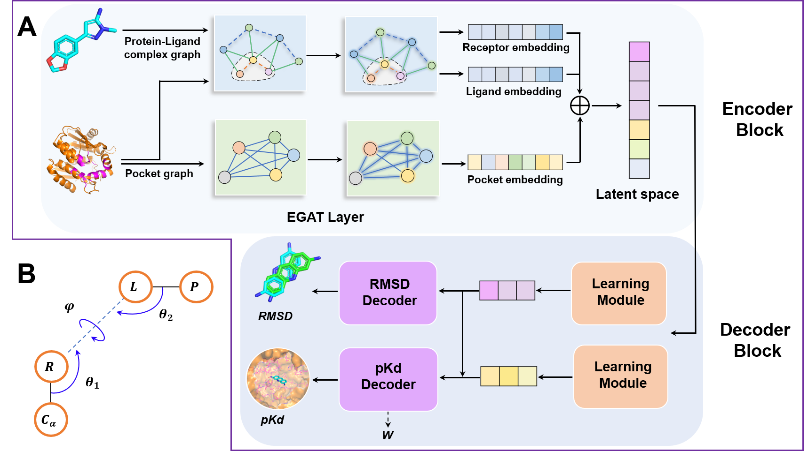

# IGModel 
Here, we proposed a unified framework that can simultaneously predict the RMSD of the ligand docking pose and the binding strength (pkd) to the target. This framework consists of an encoding module and two decoding modules. The encoding part comprises two graph structures: the protein-ligand interaction graph and the protein pocket graph. Features from these two graphs are extracted through two independent graph neural networks (GNNs) modules and ultimately aggregated into a latent space. The latent space is decoded into RMSD and pKd by two decoding components.

## Install 
You should install conda and some dependent packages, for example

	openbabel
	rdkit
	pytorch >= 1.13.0
	dgl >= 1.1.0

## Contact
Zechen Wang, PhD, Shandong University, wangzch97@163.com

## Citation
If you find our scripts useful, please consider citing the following paper:

	@article{wang2024new,
		  title={A new paradigm for applying deep learning to protein--ligand interaction prediction},
		  author={Wang, Zechen and Wang, Sheng and Li, Yangyang and Guo, Jingjing and Wei, Yanjie and Mu, Yuguang and Zheng, Liangzhen and Li, Weifeng},
		  journal={Briefings in Bioinformatics},
		  volume={25},
		  number={3},
		  pages={bbae145},
		  year={2024},
		  publisher={Oxford University Press}
		}

## Usage 
### 1. Prepare structural files.
The input files include 1) protein file (".pdb"); 2) ligand file (".mol2" or ".sdf") used to determine the binding pocket; 3) docking pose file (".mol2" or ".sdf")

### 2. If you want to specify a reference ligand structure (i.e., the cocrystal ligand of the target) to define the pocket, you can run IGModel as follows:
	python scripts/scoring.py 
	-prefix 1bcu
	-rec_fpath samples/1bcu/1bcu_protein_atom_noHETATM.pdb	
	-ref_lig_fpath samples/1bcu/1bcu_ligand.sdf
	-pose_fpath samples/1bcu/1bcu_decoys.sdf
	-model models/saved_model.pth
	-out_fpath scores.csv
You can also directly run "./run_scoring.sh" to test the script. We also provide a notebook named "Scoring-demo.ipynb" (located in the "scripts" directory) to help you understand the process of creating the dataset and scoring.

### 3. If the co-crystal ligand of the target is unavailable, we provide an alternative version where docking poses serve as a reference to define the pocket of the target. You can run the following code to implement this:
	python scripts/scoring.py 
	-prefix 1bcu 
	-rec_fpath samples/1bcu/1bcu_protein_atom_noHETATM.pdb	
	-pose_fpath samples/1bcu/1bcu_decoys.sdf 
	-model models/self-pose-ref-model.pth 
	-out_fpath self-ref_scores.csv

### 4. Create pocket graph and protein-ligand interaction graph
	$python scripts/generate_features.py \
	-pose_fpath samples/1bcu_decoys3.sdf \
	-code 1bcu \
	-rec_fpath samples/1bcu/1bcu_protein_atom_noHETATM.pdb \
	-ref_lig_fpath samples/1bcu/1bcu_ligand.sdf \
	-out_dpath 1bcu_features

## Question and Answer
To be updated ...
