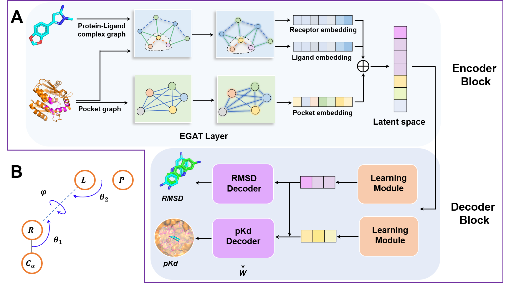

# IGModel
This model can simultaneously predict the RMSD of the ligand docking pose and the binding strength (pkd) to the target.

## Install 
You should install conda and some dependent packages, for example
    rdkit
    pytorch > 2.0.0
    dgl > 1.1.0

## Contact
Zechen Wang, PhD, Shandong University, wangzch97@163.com

## Usage 
### 1. Prepare structural files.
The input files include the protein structure file (".pdb"), the ligand structure file (".sdf") used to determine the target pocket, and the docking pose file (".mol2" or ".sdf") to be predicted.

### 2. Specify the output file path (for example scores.csv) and then run IGModel as follows:
    python scripts/scoring.py 
    	-prefix 1bcu
	-rec_fpath samples/1bcu/1bcu_protein_atom_noHETATM.pdb
	-rec_lig_fpath samples/1bcu/1bcu_ligand.sdf
	-pose_fpath samples/1bcu/1bcu_decoys.sdf
	-model models/saved_model.pth
	-out_fpath scores.csv